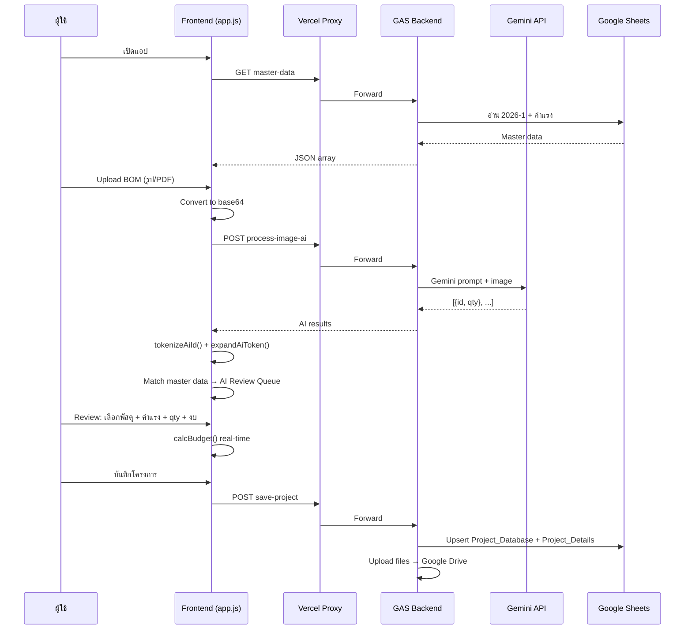
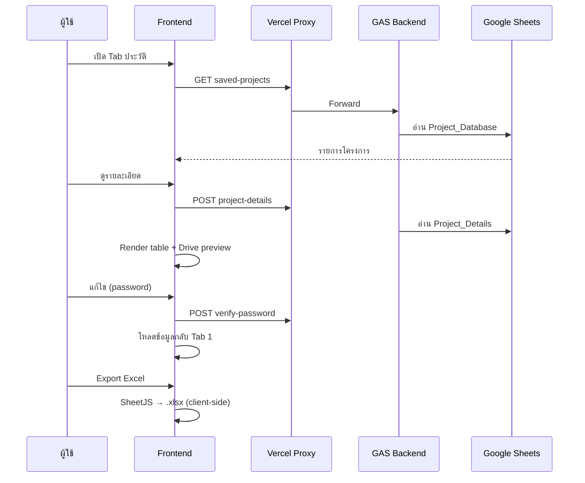

# สถาปัตยกรรมระบบ — PEA Estimation AI Pro 2026

## ภาพรวมสถาปัตยกรรม

ระบบใช้สถาปัตยกรรม **Serverless 3-Tier** โดยไม่ต้องดูแล server เอง ต้นทุนต่ำ และ deploy ได้รวดเร็ว

```
┌─────────────────────────────────────────────────────────────┐
│                    CLIENT (Browser / Mobile)                 │
│  index.html + styles.css + app.js + services.js + config.js │
└──────────────────────────┬──────────────────────────────────┘
                           │ fetch("/api/gas?action=...")
                           ▼
┌─────────────────────────────────────────────────────────────┐
│                 VERCEL (Static Hosting + Proxy)              │
│                    api/gas.js (Serverless)                   │
│         Forward request → GAS_WEB_APP_URL?action=...         │
└──────────────────────────┬──────────────────────────────────┘
                           │ HTTPS
                           ▼
┌─────────────────────────────────────────────────────────────┐
│              GOOGLE APPS SCRIPT (Backend API)                │
│                    GAS.txt → Web App Deploy                  │
│  Routes: master-data | process-image-ai | save-project | ... │
└──────┬──────────────────┬──────────────────┬────────────────┘
       │                  │                  │
       ▼                  ▼                  ▼
┌─────────────┐  ┌──────────────┐  ┌──────────────────┐
│ Google      │  │ Google       │  │ Gemini 2.5 Flash   │
│ Sheets      │  │ Drive        │  │ (AI Extraction)    │
│ (Database)  │  │ (File Store) │  │                    │
└─────────────┘  └──────────────┘  └──────────────────┘
```

---

## Layered Architecture (Frontend)

```
┌─────────────────────────────────────┐
│  Presentation Layer                 │
│  index.html — DOM structure         │
│  styles.css — Design system         │
├─────────────────────────────────────┤
│  Application Layer                  │
│  app.js — State, UI, Business Logic │
│    • state management               │
│    • budget rendering               │
│    • AI scan + review queue         │
│    • calcBudget() formulas          │
│    • history/edit/delete/export     │
├─────────────────────────────────────┤
│  Service Layer                      │
│  services.js — ApiService           │
│    • buildGasUrl()                  │
│    • request() wrapper              │
│    • typed API methods              │
├─────────────────────────────────────┤
│  Configuration Layer                │
│  config.js — APP_CONFIG             │
│    • apiBaseUrl: "/api/gas"         │
│    • endpoint names                 │
└─────────────────────────────────────┘
```

---

## Data Flow

### Flow 1: สร้างโครงการใหม่ + AI Scan



### Flow 2: ประวัติโครงการ



---

## Frontend State Model

```javascript
state = {
  dataStore: [],        // master materials จาก API
  budgets: [            // งบที่สร้างในโครงการ
    {
      type: "01.1",       // ประเภทงบ
      items: [            // รายการพัสดุ
        {
          id, name, unit,
          matPrice, labPrice,
          laborOptions: [{ desc, price }],
          qty, laborDesc, total
        }
      ],
      total: 0            // ยอดสุทธิงบนี้
    }
  ],
  historyCache: null,     // cache ประวัติ
  currentJobId: null,     // PJ-{timestamp} เมื่อแก้ไข
  currentFileUrl: "",     // URL ไฟล์เดิม (edit mode)
  tempFileList: [],       // base64 scans รอก่อนบันทึก
  aiReviewQueue: []       // คิวตรวจสอบ AI
}
```

---

## Google Sheets Schema

### Sheet: `2026-1` (Master Materials)

| Column | Field | Type | Frontend Key |
|--------|-------|------|--------------|
| B | Material ID | String | `id` |
| C | Name | String | `name` |
| D | Unit | String | `unit` |
| E | Material Price | Number | `matPrice` |
| F | Default Labor Price | Number | fallback `labPrice` |

### Sheet: `ค่าแรง` (Labor Options)

| Column | Field | Type |
|--------|-------|------|
| A | Material ID | String (FK) |
| C | Description | String |
| E | Price | Number |

→ รวมเป็น `laborOptions[]` ต่อ material

### Sheet: `Project_Database`

| Column | Field | Type |
|--------|-------|------|
| A | Project ID | String PK (`PJ-{timestamp}`) |
| B | Date | DateTime |
| C | Project Name | String |
| D | Grand Total | Number |
| E | Image URLs | String (pipe-separated `\|`) |

### Sheet: `Project_Details`

| Column | Field | Type |
|--------|-------|------|
| A | Project ID | FK |
| B | Budget Type | String |
| C | Material ID | String |
| D | Material Name | String |
| E | Quantity | Number |
| F | Total Price | Number |
| G | Labor Desc | String |
| H | Labor Price | Number |

### Sheet: `Settings`

| Cell | Field |
|------|-------|
| B1 | Edit/Delete Password |

### Sheet: `Line_Intake_Queue` (Future)

| Column | Field |
|--------|-------|
| Created At | DateTime |
| Line User ID | String |
| Display Name | String |
| Source Type | String |
| Message Text | String |
| File URL | String |
| Status | String (`NEW`) |
| Meta JSON | JSON string |

---

## AI Processing Pipeline

```
BOM Image/PDF
    │
    ▼
[Gemini 2.5 Flash]
    │ Prompt: สกัด id (ทั้งก้อน) + qty (คอลัมน์ REQ'D ช่อง I เท่านั้น)
    │ Output: JSON Array [{id, qty}]
    ▼
[tokenizeAiId()] — แยก or, /, comma, space
    │
    ▼
[expandAiToken()] — ขยาย range เช่น 1050010200-2
    │
    ▼
[Match master dataStore] — หา candidate materials
    │
    ▼
[AI Review Queue Modal]
    │ ผู้ใช้เลือก: พัสดุ + ค่าแรง + qty + งบ
    ▼
[Import to budgets[]]
```

### Material ID Parsing Rules

| Pattern | ตัวอย่าง | การทำงาน |
|---------|----------|----------|
| OR / or | `1000010004 or 1000010012` | Tokenize → หลาย candidate |
| Slash `/` | `101010/102020` | แยก token |
| Comma | `1050010200,1050010201` | แยก token |
| Range `-` | `1050010200-2` | Expand sequence |
| Mixed | `1050010200-2 1050010204` | ผสม range + space |

---

## Budget Calculation Engine

ฟังก์ชัน `calcBudget(index)` ใน `app.js`:

```
Input:  budget.items[] (matPrice, labPrice, qty)
        budget.type (01.1 | 02.1 | 02.2 | 03.1)

Step 1: M = Σ(matPrice × qty)
Step 2: L = Σ(labPrice × qty)
Step 3: Supervision = L × 0.30
Step 4: Transport = M × 0.05
Step 5: SubTotal = M + L + Supervision + Transport
Step 6: Misc = SubTotal × 0.05
Step 7: Overhead = (SubTotal + Misc) × 0.05
Step 8: PreFinal = SubTotal + Misc + Overhead
Step 9: Profit = (type === "02.2") ? PreFinal × 0.30 : 0
Step 10: Final = PreFinal + Profit
Step 11: Final = (type === "03.1") ? Final × 0.50 : Final

Output: budget.total = Final
        HTML breakdown สำหรับแสดงผล
```

---

## Security Considerations

| ประเด็น | สถานะปัจจุบัน | แนะนำ |
|---------|---------------|-------|
| Gemini API Key | Hardcoded ใน GAS.txt | ย้ายไป Script Properties |
| Edit/Delete Password | Plain text ใน Sheet B1 | Hash + salt หรือ Google OAuth |
| CORS | `Access-Control-Allow-Origin: *` | จำกัด origin ใน production |
| File Sharing | `ANYONE_WITH_LINK` | พิจารณา domain-restricted |
| Authentication | ไม่มี user login | เพิ่ม PEA SSO หรือ Google Auth |
| Input Validation | ไม่มี server-side validation | เพิ่ม validation layer |

---

## Scalability Notes

| ข้อจำกัด GAS | ผลกระทบ | ทางแก้ |
|-------------|---------|--------|
| Execution time 6 min max | AI scan หลายไฟล์ใหญ่อาจ timeout | Batch processing |
| UrlFetch quota | Gemini API calls จำกัด | Caching, rate limiting |
| Sheets row limit 10M | เพียงพอสำหรับระยะสั้น | Archive old projects |
| Concurrent users | GAS ไม่เหมาะกับ high concurrency | Migrate to Cloud Run ถ้าขยาย |

สำหรับการใช้งานภายใน กฟจ.นครพนม (scale ปานกลาง) สถาปัตยกรรมปัจจุบัน **เพียงพอ**
